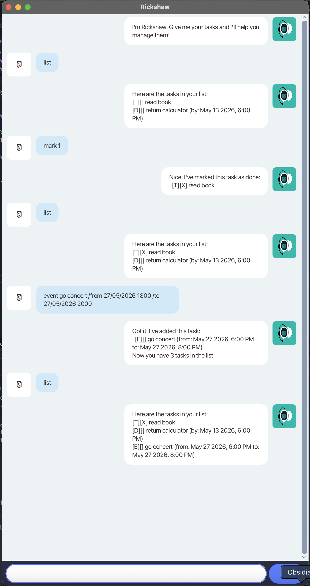

# Rickshaw User Guide



## Description of project

Rickshaw is a task management chatbot that helps you track your todos, deadlines, and events through a clean chat interface.

## Quick Start

1. Ensure you have **JDK 17** installed.
2. Download the latest `rickshaw.jar` from the [releases](https://github.com/derricklow/ip/releases) page.
3. Run the application:
   ```
   java -jar rickshaw.jar
   ```
4. Type commands in the input box and press **Send** (or Enter).

## Features

### Adding a todo: `todo`

Adds a task with no date attached.

Format: `todo DESCRIPTION`

Example: `todo read book`

Expected output:

```
Got it. I've added this task:
  [T][ ] read book
Now you have 1 tasks in the list.
```

### Adding a deadline: `deadline`

Adds a task with a due date.

Format: `deadline DESCRIPTION /by DATE_TIME`

- `DATE_TIME` must follow the format `d/MM/yyyy HHmm` (e.g. `13/03/2026 1400`).

Example: `deadline return book /by 13/03/2026 1400`

Expected output:

```
Got it. I've added this task:
  [D][ ] return book (by: Mar 13 2026, 2:00 PM)
Now you have 2 tasks in the list.
```

### Adding an event: `event`

Adds a task with a start and end time.

Format: `event DESCRIPTION /from START /to END`

- `START` and `END` can be free-form text (e.g. `2pm`, `Mon 3pm`) or date-time in `d/MM/yyyy HHmm` format.
- If both are in date-time format, the start must be before the end.

Example: `event go concert /from 27/05/2026 1800 /to 27/05/2026 2000`

Expected output:

```
Got it. I've added this task:
  [E][ ] go concert (from: May 27 2026, 6:00 PM to: May 27 2026, 8:00 PM)
Now you have 3 tasks in the list.
```

### Listing all tasks: `list`

Displays all tasks in the list.

Format: `list`

Expected output:

```
Here are the tasks in your list:
1. [T][ ] read book
2. [D][ ] return book (by: Mar 13 2026, 2:00 PM)
3. [E][ ] go concert (from: May 27 2026, 6:00 PM to: May 27 2026, 8:00 PM)
```

### Marking a task as done: `mark`

Marks the specified task as done.

Format: `mark TASK_NUMBER`

Example: `mark 1`

Expected output:

```
Nice! I've marked this task as done:
  [T][X] read book
```

### Marking a task as not done: `unmark`

Marks the specified task as not done.

Format: `unmark TASK_NUMBER`

Example: `unmark 1`

Expected output:

```
OK, I've marked this task as not done yet:
  [T][ ] read book
```

### Deleting a task: `delete`

Removes the specified task from the list.

Format: `delete TASK_NUMBER`

Example: `delete 2`

Expected output:

```
Noted. I've removed this task:
  [D][ ] return book (by: Mar 13 2026, 2:00 PM)
Now you have 2 tasks in the list.
```

### Finding tasks by keyword: `find`

Finds all tasks whose descriptions contain the given keyword (case-sensitive).

Format: `find KEYWORD`

Example: `find book`

Expected output:

```
Here are the matching tasks in your list:
1. [T][ ] read book
```

### Tagging a task: `tag`

Adds a tag to the specified task.

Format: `tag TASK_NUMBER TAG`

- Tags cannot contain `|` or `,` characters.

Example: `tag 1 urgent`

Expected output:

```
Added tag urgent to task 1
```

### Removing a tag: `untag`

Removes a tag from the specified task.

Format: `untag TASK_NUMBER TAG`

Example: `untag 1 urgent`

Expected output:

```
OK, I've untagged this task:
  [T][ ] read book
```

### Exiting the application: `bye`

Exits the application.

Format: `bye`

## Data Storage

Tasks are saved automatically to `data/rickshaw.txt` after every command that modifies the list. The file is created automatically if it does not exist.

> **Note:** Task descriptions cannot contain the `|` character, as it is used internally for data storage.

## Command Summary

| Command    | Format                                  | Description                  |
| ---------- | --------------------------------------- | ---------------------------- |
| `todo`     | `todo DESCRIPTION`                      | Add a todo task              |
| `deadline` | `deadline DESCRIPTION /by DATE_TIME`    | Add a task with a due date   |
| `event`    | `event DESCRIPTION /from START /to END` | Add a task with a time range |
| `list`     | `list`                                  | List all tasks               |
| `mark`     | `mark TASK_NUMBER`                      | Mark a task as done          |
| `unmark`   | `unmark TASK_NUMBER`                    | Mark a task as not done      |
| `delete`   | `delete TASK_NUMBER`                    | Delete a task                |
| `find`     | `find KEYWORD`                          | Find tasks by keyword        |
| `tag`      | `tag TASK_NUMBER TAG`                   | Add a tag to a task          |
| `untag`    | `untag TASK_NUMBER TAG`                 | Remove a tag from a task     |
| `bye`      | `bye`                                   | Exit the application         |
